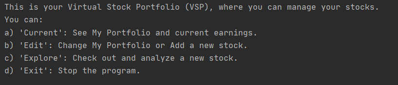
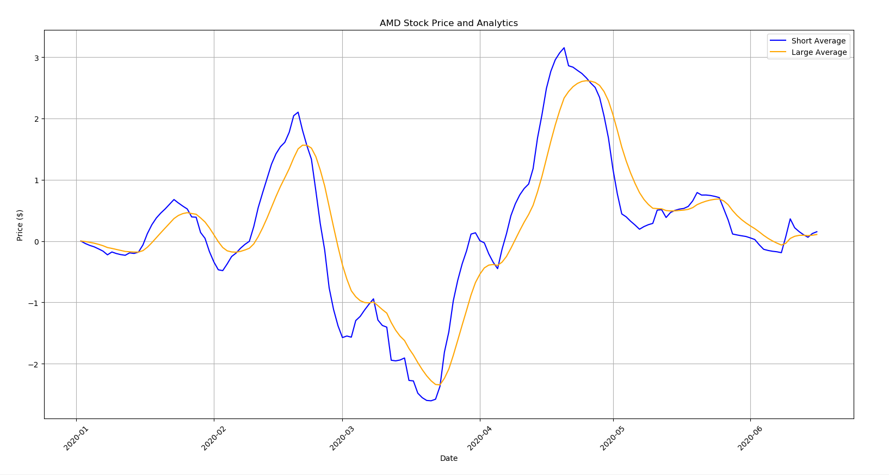

# Stock Portfolio Manager
This is an interactive program that helps you maintain your stock portfolio. When running the program, you will be able to see the different options you have and what you can do. The program allows you to: see your current portfolio and analyze some stocks, edit your current portfolio, and explore other stocks in the market and do some analysis. 

Code and Resources Used
-
To properly run this program you will need to install:
- Python 3.7
- Pandas
- CSV
- Matplotlib
- Colorema
- Datetime

Link to my sources on financial analysis:
- Simranpal Singh youtube channel: Simranpal explains how to do some intrinsic value calculation that were very helpful https://www.youtube.com/channel/UCOi_Zu4asFEMKISIbL9yuUA
- Luke Posey's MACD in Python: https://towardsdatascience.com/implementing-macd-in-python-cc9b2280126a

Running the program
-
This project consist of an interactive program using user input to maintain and analyze stocks from csv file.

To start the program, open the homeInput.py file and hit run. Start by adding some stocks with the commands specified between '' to call the different commands. In this program you can:

Each command has its own step of subcommands that allow you to do a specific thing within the command you entered.

This program will be helpful to people who are starting to trade in the stock market, like myself, and see some analytics that are done to further understand a stock. Personally, I use the graphs to see the different momentums of a stock and have a small inside on what action to take. 

Stock Price Graph:

Stock MACD Graph:

Also, I use the intrinsic value calculation to see an estimate of what the value of a specfic stock should be. 

QCOM Intrinsic Value Calculation:

